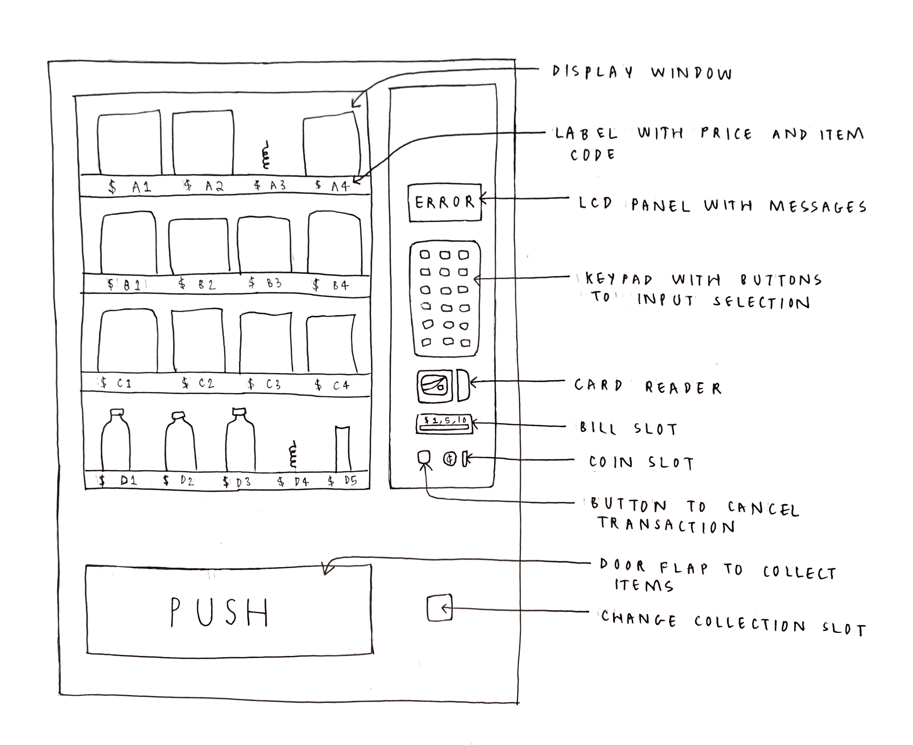
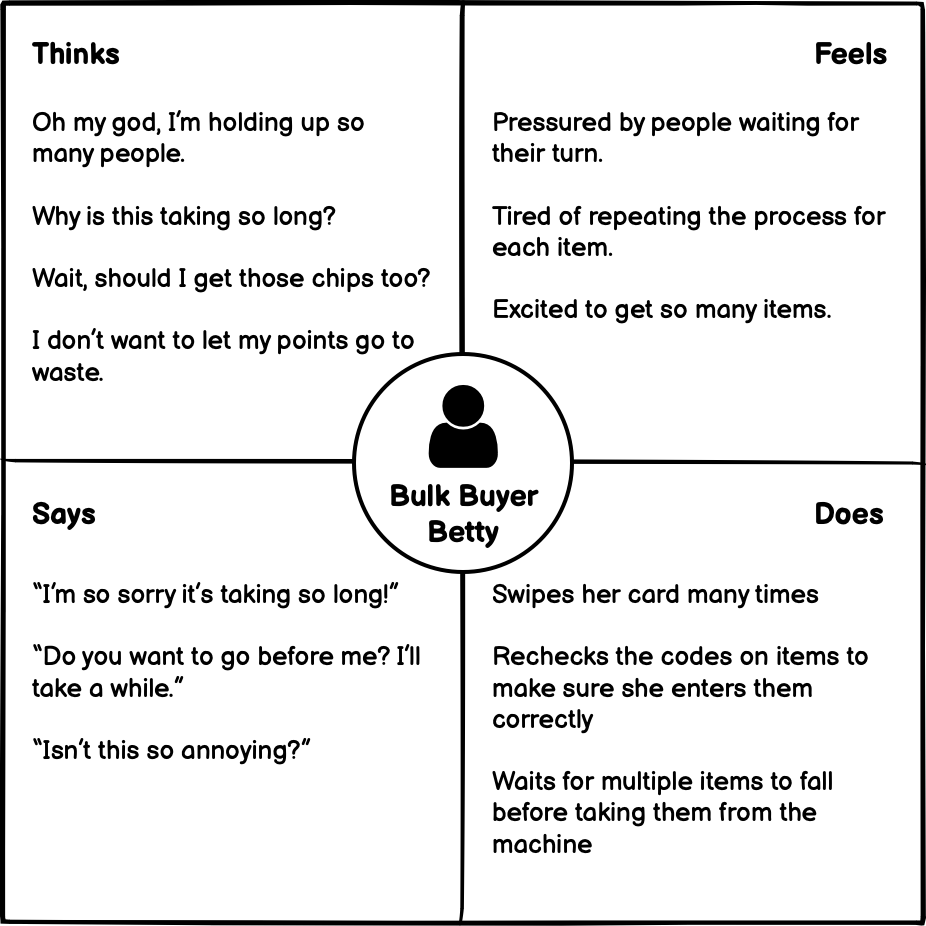
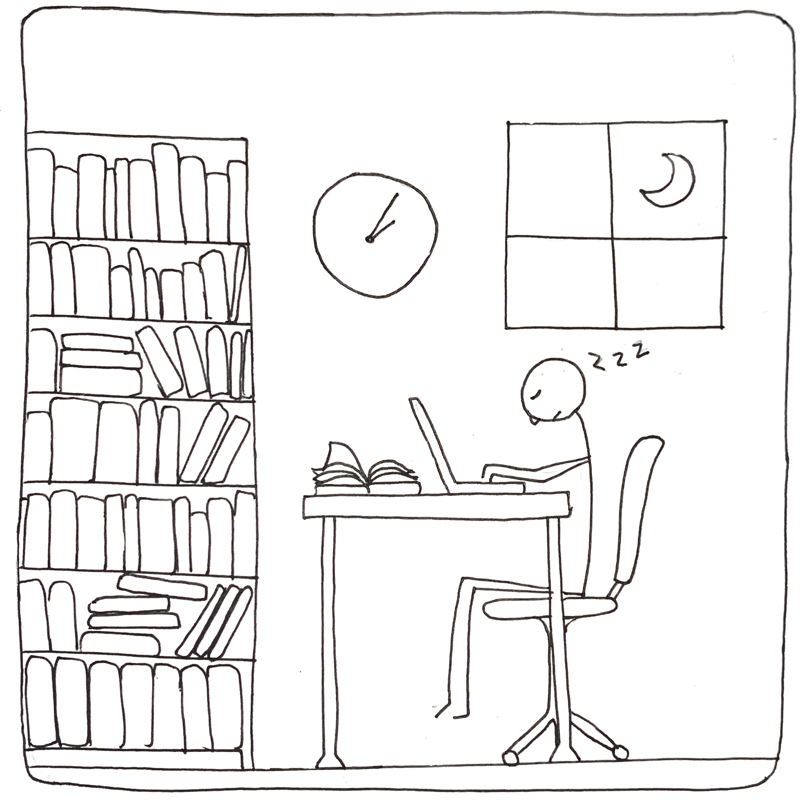

# personasandstoryboarding.github.io

<//!DOCTYPE html>
<//link rel="stylesheet" type="text/css" href="main.css" />

<//html>

    <head>
        <title>Vending Machine: Personas and Storyboard</title>
        
    </head>

    <body>

        <h1 class="box">Vending Machine: Personas and Storyboard for Campus Vending Machine</h1>

        

            <h2>Background</h2>
            

                After observing users and conducting interviews, I created user personas for a public on-campus vending 
                machine; I also created a storyboard for one user. The process taught me a lot - not only how to pick out 
                general patterns of user behaviour and segment users, but, surprisingly, that there are good and bad ways to
                ask questions in an interview.
            

        

        

            <h2>Public Interface: Campus Vending Machine</h2>

            

    
                

                    
                

                
                

                    Vending machines provide quick and easy access to a variety of snacks and drinks; a vending machine 
                    interface makes the process of buying a snack quicker and more convenient by offering variable payment 
                    options and eliminating interaction between the customer and salespeople.
                

    
                <h3>Key Components</h3>
    
                <ul>
                    <li>Display window</li>
                    <li>Keypad with buttons</li>
                    <li>Slots for cash payment</li>
                    <li>Change collection slot</li>
                    <li>Card reader</li>
                    <li>LCD panel</li>
                    <li>Button to cancel transaction</li>
                    <li>Door flap</li>
                    <li>Graphics and text to direct the user</li>
                </ul>
    
            

        

        

            <h2>Process</h2>

            

    
                

                    I observed several users of an on campus vending machine, once in the day and once later at night (around 11 PM).
                

    
                

                    <h3>Key Observations</h3>
                    <ul>
                        <li>All users used the card reader for payment (credit/debit cards or student ID cards). </li>
                        <li>
                            All users swiped their card through the card reader multiple times, either flipping the card around or 
                            changing the direction in which they swiped.
                        </li>
                        <li>All users checked the screen after swiping their cards to see if it had worked.</li>
                        <li>
                            Most users looked back and forth between the display window and keypad multiple times before inputting 
                            their selection.
                        </li>
                        <li>Most users inputted their selections slowly and carefully.</li>
                        <li>
                            More users approached the vending machine at night than in the day. A few swiped once, didn't make 
                            a selection, and went away.
                        </li>
                        <li>Most users purchased one item.</li>
                        <li>
                            One user purchased multiple items (during the day), repeating the swipe-select-collect process multiple 
                            times - this user apologized repeatedly to the person next to them for the time it took.
                        </li>
                    </ul>
                

    
                

                    I also interviewed three users for deeper insights.
                

    
                

                    <h3>Interview Summary</h3>
        
                    <h4>Questions</h4>
                    <ol>
                        <li>What motivates you to use a campus vending machine?</li>
                        <li>Is there a typical pattern to the times that you use vending machines?</li>
                        <li>Which method of payment do you like best?</li>
                        <li>Have you experienced any challenges in the process of using campus vending machines?</li>
                        <li>What would be your ideal way of conducting a full transaction at a vending machine?</li>
                    </ol>
        
                    <h4>Answers</h4>
                    <ol>
                        <li>
                            There were two major motivations: first, to stock up on stacks after running out, and if the user has a lot
                            of points to spend on their student card; second, as a last resort when a user needs
                            a hit of sugar and nothing else is open or nearby.
                        </li>
                        <li>
                            Users tend to use vending machines more often at night, during weekdays, and during colder months
                            of the year.
                        </li>
                        <li>
                            Users prefer card payments since they do not typically carry cash or coins - either the student card if 
                            they have points on it, or credit/debit cards.
                        </li>
                        <li>
                            It's difficult to tell which way to swipe your card and whether it has worked; you cannot buy lots of 
                            things with one swipe and must do multiple transactions; using a credit card loads a default $4 into the
                            machine even if you only want one item; there's no indication of how much time you have to make your
                            selections before the machine shuts down your transaction; and the collection door is low and annoying
                            to use.
                        </li>
                        <li>
                            Two distinct ideas were brought up: first, to swipe a card at the machine and have it just take the 
                            cost of the desired item, so there is no waste of money; second, to enter a total amount of money, add 
                            items until meeting that total, and be able to buy them all at once instead of one at a time, saving
                            time.
                        </li>
                    </ol>
                

    
            

        

    
        

            <h2>Personas</h2>

            

                
                
I created empathy maps to represent my two user personas - Bulk Buyer Better and Last Resort Liam.

                

                    
Bulk Buyer Betty

                    
                    
Betty is...

                

                

                    
Last Resort Liam

                    
                    
Liam is...

                

            

        

        

            <h2>Storyboard</h2>
            <h3>Persona: Liam</h3>
    
            

    
                

                    
                    
Liam is studying late in the library and starts to feel sleepy. He needs to finish his assignment tonight, so he needs some sugar or caffeine.

                

    
                

                    
                    
Liam sees that it's too late to go to a convenience store. He also doesn't want to go far from the library.

                

    
                

                    
                    
Liam goes to the vending machine in the library to look for something there.

                

    
                

                    
                    
Liam looks at the options through the display window and finds Gatorade, with item code E1.

                

    
                

                    
                    
Liam swipes his credit card through the card reader, loading money into the vending machine. It takes $4 by default.

                

    
                

                    
                    
Liam uses the buttons on the keypad to input his selection, E1. The screen shows his current cash balance and updates with his selection as he pushes the buttons.

                

    
                

                    
                    
Liam still has a $2.25 balance, so he also gets some chocolate pretzels, which have item code D2, again using the keypad.

                

    
                

                    
                    
Liam checks the screen to see his new balance. It isn't enough to get anything else, so he doesn't input any more codes.

                

    
                

                    
                    
Done making choices, Liam pushes the collection door flap in so he can remove his Gatorade and chocolate pretzels, which were dropped into the collection area.

                

    
                

                    
                    
Having successfully got his items, Liam takes a drink of Gatorade to renew his energy.

                

    
                

                    
                    
Liam goes back to work with his snacks, having got enough sugar to be more alert.

                

    
            

        

    </body>

<//html>